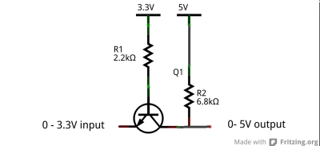

# Sonoff Basic Modified as 2 Channel device

## Sonoff Basic

This device is a modification of an existing sonoff basic which is a single channel device. This project aims to add/modify the following capabilities to the sonoff basic:  

- Decouple the output relay from the sonoff basic power supply. Sonoff basic's output relay is connected to the input AC supply and so I have modified the same to make the relay independent.
- Add one more relay to the device. Sonoff only comes with one relay. I have added one more Active low relay which is conneted to GPIO2. 
- Add 2 manual switches to the sonoff. Sonoff Basic comes with only one switch that too connected to GPIO0. The disadvantage of using GPIO0 is that it can only be used with a momentary switch , not with a 2 state switch. I have used different GPIO for the switch and broken out the same on the PCB.  
- Add one more GPIO to the board. I have soldered a wire to GPIO14 and connected that to the K_P pin on the RF slot. I did this but did not end up using the GPIO as GPIO2 is good enough. Also, Soldering a wire to GPIO14 on the ESP chip is very difficult and I may not be able to do that on all Sonofs I plan to modify.
- Replaced the long GPIO0 switch with a small one.

Image of the modified Sonoff Basic  

PCB Descriptions:

- It already has GND,Tx,RX,3V3 broken out on the board.
- GPIO2 is a test pad to which I have soldred a wire and brought above the PCB (Blue wire)
- Status LED is connected to the board has been removed and GPIO13 repurposed as an input PIN.
- The other two connected of the 2 state LED are not used. See Schematic for more details if you want to. They are supposed to be used by the RF module on the sonoff and are not connected.
- The relay module added is a Active LOW relay which works on 5V. As the sonff GPIO works on 3.3V I have introduced a 3.3V to 5V level shifter in between using the following circuit. 

