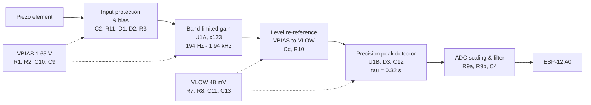

# Piezo Vibration Sensor — Analog Front End

Design reference for the piezo-based vibration sensor used to detect a continuously leaking tap.

The front end converts raw piezo output into a slow, smooth **envelope voltage** that an ESP8266
ADC can read directly. Detection logic (baseline tracking, thresholds, dwell) lives in firmware;
this board's job is to deliver a clean, correctly band-limited signal.

- **Supply:** single +3.3 V
- **Op-amp:** TLV9062 (dual, rail-to-rail input and output)
- **Output:** 15 mV – 1.03 V, suitable for a bare ESP-12 A0 (0–1.0 V full scale)
- **Passband:** ~194 Hz – 1.94 kHz
- **Envelope time constant:** 0.32 s

---

## 1. Block diagram



### Signal chain

```
Piezo ─ C2 ─ R11 10k ─┬─ R3 100k ── VBIAS
                      ├─ D1 / D2 clamps
                      └─ U1A pin 3
                              │
                   R4 1M feedback, R5 8k2 + C7 to VBIAS    → gain 123
                              │
                    R6 8k2 ─┬─ C3 0.01µ ── VBIAS           → LPF 1.94 kHz
                            │
                            └─ Cc 0.1µ ─┬─ U1B pin 5
                                        └─ R10 100k ── VLOW (48 mV)
                              │
                    U1B pin 7 ─ D3 ─┬─ NODE X ── back to pin 6
                                    ├─ C12 10µ ── GND
                                    └─ R9a 22k ─┬─ R9b 10k ── GND
                                                ├─ C4 10µ ── GND
                                                └──► ESP-12 A0
```

**Reading the diagrams:** `┬` `├` `└` `│` are junctions — every branch hanging off one is the
same electrical node. Anything drawn hanging downward is a shunt, not part of the series path.

---

## 2. Stage functions

### Stage 1 — Input protection and bias

| Ref | Value | Role |
|---|---|---|
| C2 | 1 µF | blocks DC; couples the piezo's AC output |
| R11 | 10 k | limits fault current into the clamps and the op-amp |
| D1 | 1N5819 | clamp — anode to NODE A, cathode to +3.3 V |
| D2 | 1N5819 | clamp — anode to GND, cathode to NODE A |
| R3 | 100 k | biases NODE A to VBIAS |

A piezo is a capacitive, high-impedance source that can generate **tens to hundreds of volts**
when struck. D1 and D2 hold NODE A within one diode drop of the supply rails; R11 limits the
resulting current to a few milliamps. In normal operation both diodes are reverse-biased and
electrically invisible.

R3 sets the DC operating point at VBIAS. It also forms a high-pass with the piezo's own
capacitance (≈15 nF), rolling off below **~106 Hz** — useful rejection of structural thumps and
thermal drift, at no component cost. 100 k is chosen over a larger value to keep the resistor's
thermal noise from dominating the TLV9062's own 10 nV/√Hz.

### Stage 2 — Band-limited gain

| Ref | Value | Role |
|---|---|---|
| U1A | TLV9062 | non-inverting gain stage |
| R4 | 1 M | feedback |
| R5 | 8.2 k | gain-set leg |
| C7 | 0.1 µF | in series with R5 |
| R6 | 8.2 k | low-pass series element |
| C3 | 0.01 µF | low-pass shunt |

$$\text{AC gain} = 1 + \frac{R_4}{R_5} = 1 + \frac{1\text{M}}{8.2\text{k}} = 123$$

C7 in series with R5 is the key detail: it makes **DC gain = 1** while leaving AC gain at 123.
Without it, the op-amp's input offset voltage would be amplified 123× — up to ±220 mV of
temperature-drifting error on the output. It simultaneously sets the low end of the passband:

$$f_{HP} = \frac{1}{2\pi R_5 C_7} = \frac{1}{2\pi \cdot 8.2\text{k} \cdot 0.1\mu} \approx 194\ \text{Hz}$$

R6/C3 set the top of the passband:

$$f_{LP} = \frac{1}{2\pi R_6 C_3} = \frac{1}{2\pi \cdot 8.2\text{k} \cdot 0.01\mu} \approx 1.94\ \text{kHz}$$

**Why this band.** Turbulent flow noise from a leak is broadband hiss, typically 300 Hz – 4 kHz.
Below ~200 Hz sits everything that should be rejected: mains hum, footsteps, door slams, HVAC,
and piezo thermal drift. The passband is deliberately placed to keep the former and discard the
latter.

Only one gain stage is used. Required gain-bandwidth is 123 × 2 kHz ≈ 250 kHz against the
TLV9062's 10 MHz, so a single stage is comfortable — which frees the second op-amp for Stage 4.

### Stage 3 — Level re-referencing

| Ref | Value | Role |
|---|---|---|
| Cc | 0.1 µF | AC-couples the signal off VBIAS |
| R10 | 100 k | biases U1B's +IN to VLOW |

Stages 1–2 operate around VBIAS = 1.65 V. The bare ESP-12 ADC accepts **0–1.0 V**, so the
detector must not rest at 1.65 V. Cc strips the VBIAS reference and R10 re-establishes the
signal around **VLOW ≈ 48 mV**, close to ground.

$$f_c = \frac{1}{2\pi R_{10} C_c} = \frac{1}{2\pi \cdot 100\text{k} \cdot 0.1\mu} \approx 16\ \text{Hz}$$

16 Hz is far below the 194 Hz passband, so this coupling has no effect on the signal of
interest. R10's 100 k is what places the corner there — feeding Cc into the stiff VLOW divider
directly would put it near 1 kHz and eat the passband.

⚠️ **Cc must be film or ceramic, not electrolytic.** It sits between a 1.65 V node and a 48 mV
node, so an electrolytic would be reverse-biased.

### Stage 4 — Precision peak detector (envelope)

| Ref | Value | Role |
|---|---|---|
| U1B | TLV9062 | superdiode buffer |
| D3 | 1N5819 | rectifier, **inside** the feedback loop |
| C12 | 10 µF | envelope storage (+ to NODE X, − to GND) |

D3 sits inside U1B's feedback loop — the feedback wire is taken from **NODE X (the cathode)**,
not from pin 7. This divides the diode's forward drop by the op-amp's open-loop gain, reducing
it to microvolts. A passive rectifier would instead have a ~0.2 V dead zone that drifts at
−2 mV/°C, making small signals invisible and the detection threshold temperature-dependent.

The storage network returns to **GND**, not VBIAS, which is what places the resting output near
48 mV instead of 1.65 V.

$$\tau = (R_{9a} + R_{9b}) \times C_{12} = 32\text{k} \times 10\mu \approx 0.32\ \text{s}$$

Fast attack, slow decay: the envelope rises quickly on vibration and rides through the gaps in
the hiss rather than following individual cycles.

The TLV9062's rail-to-rail input **and** output range is what allows this stage to operate
within 50 mV of the negative rail. A non-RRIO op-amp would not work here.

### Stage 5 — ADC scaling and filtering

| Ref | Value | Role |
|---|---|---|
| R9a | 22 k | divider top / discharge path |
| R9b | 10 k | divider bottom / discharge path |
| C4 | 10 µF | ADC anti-alias and noise filter |

The two-resistor divider does three jobs at once, which is why no output buffer is needed:

1. **Scales** the envelope into the ESP-12's 0–1.0 V window
2. **Discharges** C12, setting the 0.32 s time constant
3. **Drops the source impedance** to 6.9 k, low enough for the SAR ADC's sampling capacitor

| | Value |
|---|---|
| Divider ratio | 10 k / 32 k = 0.3125 |
| Rest voltage at A0 | 48 mV × 0.3125 ≈ **15 mV** (~15 counts) |
| A0 at full op-amp swing (3.3 V) | ≈ **1.03 V** |
| Source impedance | 22 k ∥ 10 k ≈ **6.9 k** |

**A0 cannot exceed ~1.03 V even if U1B saturates against the rail.** The divider is inherently
protective, so no clamp diode is required on the ADC input.

C4 sets the final noise filter:

$$f_c = \frac{1}{2\pi \cdot 6.9\text{k} \cdot 10\mu} \approx 2.3\ \text{Hz}$$

The envelope carries information at roughly 0.5 Hz, so 2.3 Hz preserves the signal completely
while heavily attenuating everything above it. This matters on ESP8266: the radio draws
250–350 mA in millisecond bursts, and its ADC shares silicon with the RF section. This capacitor
is what makes ESP-side readings as clean as a quiet, radio-free microcontroller's.

C4 is polarised — **+ to the A0 node, − to GND**.

### References and decoupling

| Ref | Value | Role |
|---|---|---|
| R1, R2 | 100 k | VBIAS divider → 1.65 V |
| C10 | 10 µF | VBIAS bulk |
| C9 | 0.1 µF | VBIAS high-frequency |
| R7 | 100 k | VLOW divider top |
| R8 | 1.5 k | VLOW divider bottom |
| C11 | 10 µF | VLOW bulk |
| C13 | 0.1 µF | VLOW high-frequency |
| U1C | — | TLV9062 power unit |
| C8 | 0.1 µF | op-amp supply decoupling |

$$V_{BIAS} = 3.3 \times \frac{100\text{k}}{200\text{k}} = 1.65\ \text{V}
\qquad
V_{LOW} = 3.3 \times \frac{1.5\text{k}}{101.5\text{k}} \approx 48\ \text{mV}$$

Each rail carries both a 10 µF bulk capacitor and a 0.1 µF ceramic: electrolytics have poor
high-frequency impedance, and VBIAS ripple is amplified by the ×123 stage.

⚠️ **C8 must be placed physically adjacent to pins 8 and 4.** A 10 MHz op-amp with a 1 M
feedback resistor can oscillate without local decoupling, and the capacitor's value is
irrelevant if it sits 30 mm away.

---

## 3. Complete bill of materials

| Ref | Value | Notes |
|---|---|---|
| U1 | TLV9062 | dual RRIO op-amp, SOIC-8 |
| Piezo1 | — | piezo disc |
| C2 | 1 µF | film preferred (+ toward R11 if polarised) |
| C3 | 0.01 µF | |
| C4 | 10 µF | + to A0 node |
| C7 | 0.1 µF | |
| C8 | 0.1 µF | at op-amp pins 8 / 4 |
| C9 | 0.1 µF | |
| C10 | 10 µF | + to VBIAS |
| C11 | 10 µF | + to VLOW |
| C12 | 10 µF | + to NODE X |
| C13 | 0.1 µF | |
| Cc | 0.1 µF | **film or ceramic only** |
| D1, D2 | 1N5819 | input clamps |
| D3 | 1N5819 | rectifier, inside feedback loop |
| R1, R2 | 100 k | |
| R3 | 100 k | |
| R4 | 1 M | feedback |
| R5 | 8.2 k | gain leg |
| R6 | 8.2 k | |
| R7 | 100 k | |
| R8 | 1.5 k | |
| R9a | 22 k | |
| R9b | 10 k | |
| R10 | 100 k | |
| R11 | 10 k | |

### Key parameters

| Parameter | Value |
|---|---|
| Gain (AC) | 123 |
| Gain (DC) | 1 |
| Passband | 194 Hz – 1.94 kHz |
| VBIAS | 1.65 V |
| VLOW | 48 mV |
| Envelope τ | 0.32 s |
| ADC filter corner | 2.3 Hz |
| Output at rest | ~15 mV (~15 counts) |
| Output maximum | ~1.03 V |

---

## 4. Bring-up

A0 should read **~15 counts at rest**, rising with vibration.

| Reading | Likely cause |
|---|---|
| Pinned at 1023 | C12 or the divider returns to VBIAS instead of GND |
| Stuck at 0 | Cc open, R10 missing, or D3 reversed |
| ~500 at rest | VLOW divider wrong — check for 15 k fitted instead of 1.5 k |
| Everything at 0 V | VBIAS rail shorted to GND |

### Gain adjustment

At ×123 the op-amp reaches the rail at roughly **27 mV peak** from the piezo, so sharp
transients clip. This is acceptable for an event detector, and clipped transients are rejected
by the firmware's dwell logic. If the ambient floor sits too high, reduce R4:

| R4 | Gain |
|---|---|
| 1 M | 123 |
| 470 k | 58 |
| 220 k | 28 |

---

## 5. Testing on a D1 Mini

The D1 Mini's A0 has an onboard 220 k / 100 k divider giving a **0–3.3 V** range, rather than
the bare ESP-12's 0–1.0 V. To use the full ADC range, move a single wire:

| | ESP-12 | D1 Mini |
|---|---|---|
| A0 tap point | R9a / R9b junction | **NODE X** (D3 cathode / C12 top) |
| Everything else | — | identical |

Leave R9a and R9b fitted — they remain C12's discharge path, so τ stays 0.32 s. When tapping
NODE X, place C4 directly between the **A0 pin and GND** with short leads.

NODE X swings 48 mV – 3.3 V, matching the D1 Mini's range. The 32 k source impedance into its
~320 k input costs about 9% attenuation — constant and linear, and absorbed by the firmware's
adaptive baseline.

### Breadboard note

This circuit contains 1 M and 100 k nodes sitting near a 2.4 GHz transmitter. On a breadboard
these pick up mains hum and RF, so the noise floor will look worse than on the final board.
**Do not set detection thresholds from breadboard traces.** Use a star ground back to a single
point at the ESP's GND pin, and keep the piezo leads and U1A's feedback loop short.

---

## 6. Firmware interface

The board presents a slow, smooth envelope voltage on A0. Firmware still needs to decide what it
means, because the *ambient* hiss level drifts with time of day, appliances, and neighbouring
plumbing. The intended chain is:

1. Sample A0 at a fixed interval
2. Track an **adaptive baseline** (EWMA, frozen while an event is active)
3. Compute a **z-score** against running dispersion
4. Apply **hysteresis and a dwell timer** so only sustained vibration registers as a leak

A leaking tap produces *continuous* hiss; impacts and handling produce *transients*. That
difference lives in the envelope's persistence, which is why dwell time — not peak amplitude —
is the primary discriminator.
